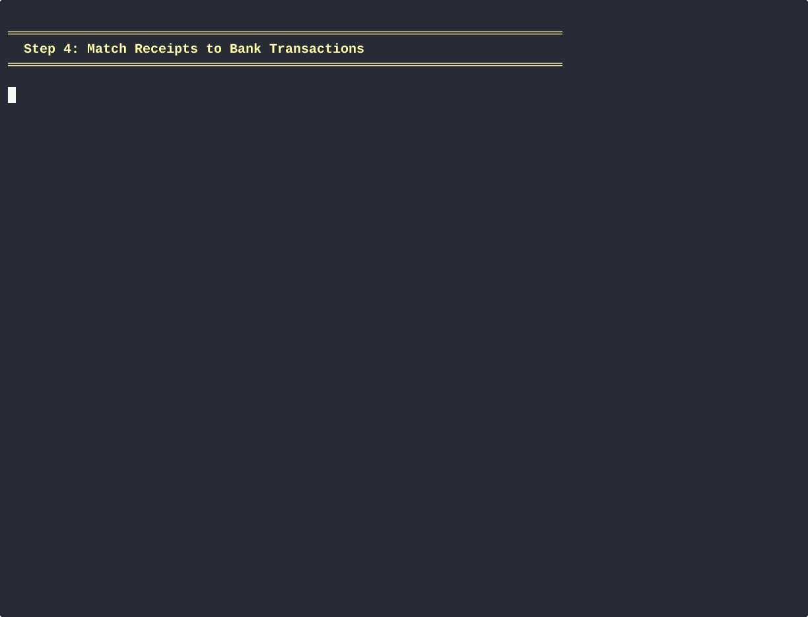

# Plan: Improve Matching Algorithm Demo (Step 3)

## Scope
This plan focuses **only on Step 3 (Match receipts to CSV transactions)** in the README.

## Goal
Make the matching algorithm demo more instructive by:
1. Showing the **real CLI command** instead of verbose simulated terminal output
2. Using a **cropped receipt image** to illustrate what's being matched
3. Using a **simple 3-transaction CSV example** to show how matching works
4. Showing the **financial outcome** after matching

## Current State

### Current Step 3 in README
```markdown
**Step 3: Match receipts to bank transactions**

Algorithmically/semi-automated linking of receipts to your bank/exchange CSV transactions...


```

### Current GIF Generator (`gifs/automation/simulated_match_demo.py`)
- Shows fake/synthetic terminal output (It should use the real CLI output that is generated when running ./start.sh)
- Prints explanatory text about how matching works. (It should use the real CLI output that is generated when running ./start.sh)
- Simulates matching 3 receipts (Ekoplaza, Bike Repair Shop, Odin) (It should just match 1 receipt, the one that is rotated and cropped in the previous gif of 2.a (and then labelled in 2.b))
- No actual receipt image shown (For starters, assume this image is shown in the readme, and focus on the CLI matching algorithm) and the cat of the .csv file.

## Tasks
1. Use the image from the rotate and crop.
2. create a csv that is valid with the example config that contains the transaction from that rotaed cropped receipt.
3. Set up the test envrionment like in /using: run_start_sh_test.py
4. Run ./start.sh or whatever is needed to get to the step where the matching algorithm can be ran. 
5. Call hledger_preprocessor \
        --config "$config_filepath" \
        --link-receipts-to-transactions
to record the linking of the receipt to the csv transaction.
6. Show a cat of the linked transaction and a cat of the linked, labelled receipt json.
7. Ensure the gif is stored.