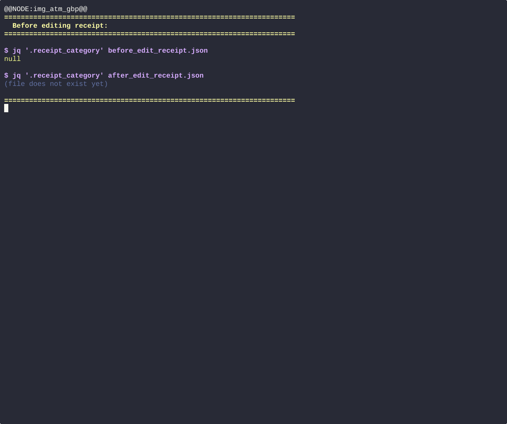
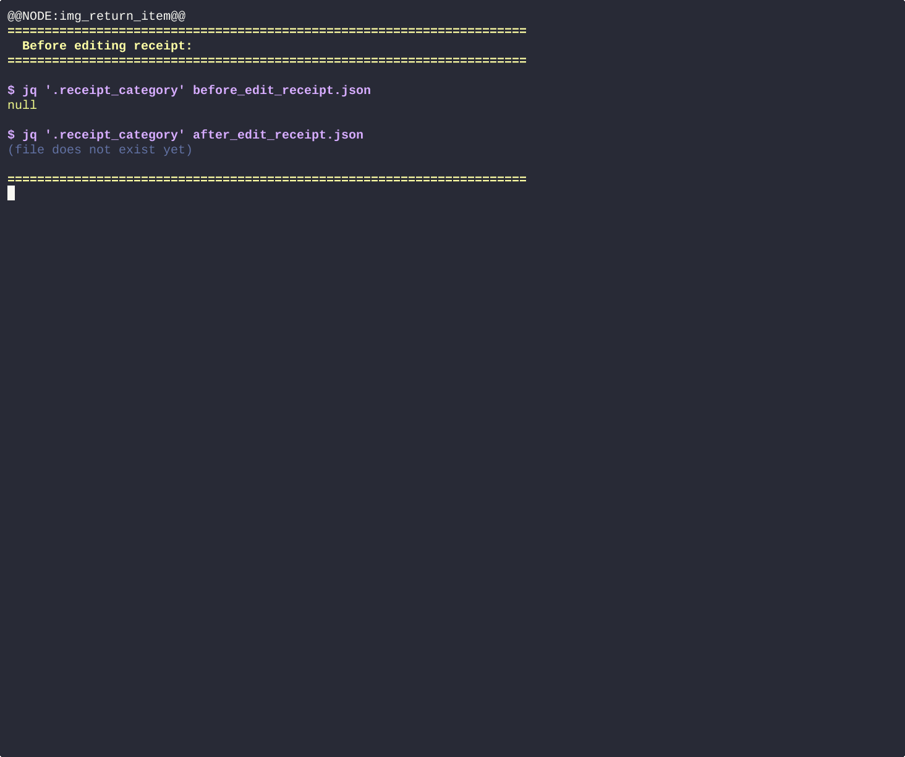
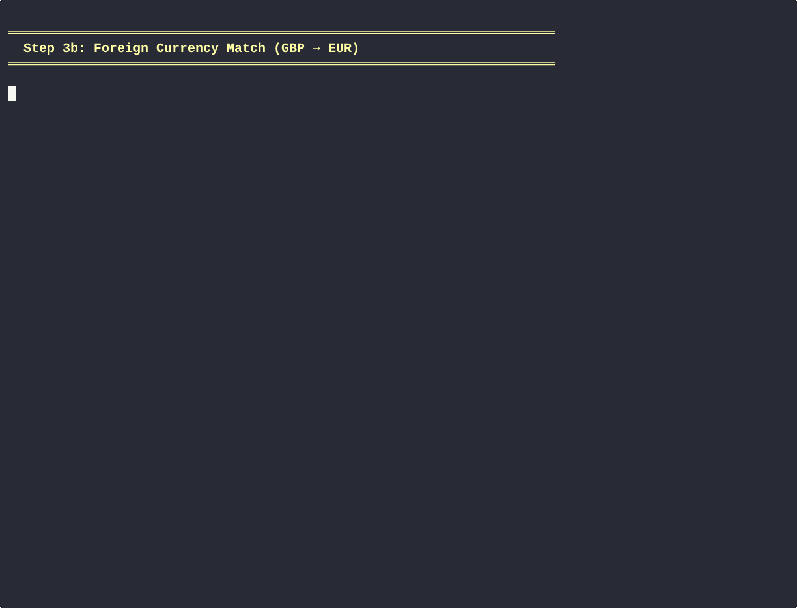
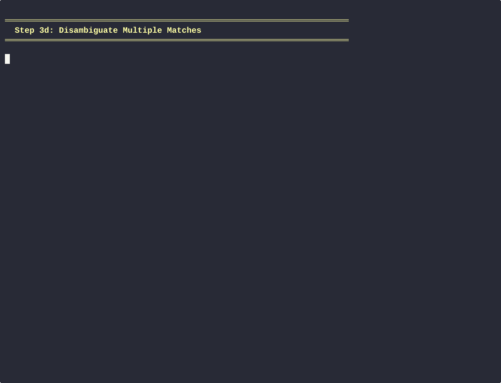

# hledger-preprocessor

[![Python 3.10+][python_badge]](https://www.python.org/downloads/)
[![License: AGPL v3][agpl3_badge]](https://www.gnu.org/licenses/agpl-3.0)
[![Code Style: Black][black_badge]](https://github.com/ambv/black)

Automate your double-entry bookkeeping. This CLI tool preprocesses bank CSV
statements and receipt images into [hledger](https://hledger.org/) journals
via [hledger-flow](https://github.com/a-t-0/hledger-flow) — categorising
transactions, matching receipts to bank records, and generating balance
reports and plots.

## Workflow

### 1. Configure accounts and categories

Define your bank accounts and spending categories in YAML:


### 2. Label receipts

Crop receipt images, then use the TUI to enter date, shop, amount, and
payment method:


<details>
<summary>More receipt labelling demos</summary>

**Cash receipt** (no bank CSV match):


**Foreign currency** (e.g. ATM withdrawal in GBP):



**Split payment** (multiple accounts for one purchase):


**Returned items** (negative line items):



</details>

### 3. Match receipts to bank transactions

Algorithmically link receipts to CSV transactions. A matching CLI resolves
mismatches (date shifts, foreign currency fees, duplicate candidates):


<details>
<summary>More matching demos</summary>

**Foreign currency matching** (conversion fees):



**Widen date range** (bank processed days later):


**Disambiguate** (multiple candidates for same amount):



</details>

### 4. Run the pipeline

One command to preprocess, import, and generate reports:

```bash
hledger_preprocessor --run-pipeline --config /path/to/config.yaml
```


### 5. Visualize your finances

Interactive Sankey diagrams and treemap plots via
[hledger-plot](https://github.com/a-t-0/hledger-plot):


## Installation

```bash
pip install hledger-preprocessor

# With optional AI-based transaction categorisation:
pip install hledger-preprocessor[ai]
```

Requires Python 3.10+.

## Usage

```bash
# Full automated pipeline
hledger_preprocessor --run-pipeline --config config.yaml

# Individual steps
hledger_preprocessor --map-csv bank_export.csv          # Interactive CSV column mapping
hledger_preprocessor --tui-label-receipts --config ...  # Receipt labelling TUI
hledger_preprocessor --match-receipts --config ...      # Batch receipt matching
hledger_preprocessor --preprocess-csvs --config ...     # Process CSV transactions
hledger_preprocessor --generate-rules --config ...      # Generate hledger rules
hledger_preprocessor --check-categorisation --config ...# Validate categorisation

# Non-interactive mode (for CI/CD)
hledger_preprocessor --run-pipeline --config ... --non-interactive
```

Run `hledger_preprocessor --help` for all options.

## Architecture

The project is split into focused sub-packages:

| Layer | Package                      | Role                                                      |
| ----- | ---------------------------- | --------------------------------------------------------- |
| 0     | `hledger-core`               | Data structures (Account, Transaction, Receipt, Currency) |
| 1     | `hledger-config`             | YAML config loading, CLI argument parsing                 |
| 2     | `hledger-csv-mapping`        | CSV column mapping and templates                          |
| 2     | `hledger-receipt-processing` | Receipt labelling, matching, linking                      |
| 2     | `hledger-rules`              | hledger rule file generation                              |
| 2     | `hledger-ai`                 | Self-hosted AI categorisation (optional)                  |
| 3     | **`hledger-preprocessor`**   | **CLI orchestrator — this package**                       |
| —     | `tui-image-labeller`         | urwid-based receipt labelling TUI                         |
| —     | `hledger-plot`               | Sankey/treemap financial plots                            |

## Building the demo site

The GIF demos above are auto-generated from integration tests and served as
an interactive website with synchronized video + DAG diagrams.

```bash
# Re-record a single GIF, rebuild site, and serve:
./build_userstories.sh --gif 2b_label_receipt --serve

# Rebuild site from existing GIFs and serve:
./build_userstories.sh --serve

# Just serve (no rebuild):
./build_userstories.sh --serve-only

# Re-record all GIFs + rebuild + serve:
./build_userstories.sh --gifs-standalone --gifs-config --serve
```

Run `./build_userstories.sh --help` for all options.

<details>
<summary>Pipeline overview diagram</summary>


See [docs/gif_pipeline_overview.puml](docs/gif_pipeline_overview.puml).
To regenerate: `plantuml -tsvg docs/gif_pipeline_overview.puml`

</details>

## Tests

```bash
python -m pytest                            # All tests
python -m pytest test/unit/ test/integration/  # Skip slow e2e tests
python -m pytest test/e2e/                  # e2e only
```

## Terminology

| Term                    | Meaning                                                   |
| ----------------------- | --------------------------------------------------------- |
| **journal**             | A list of transactions in hledger format                  |
| **posting**             | A single line within a transaction (one account movement) |
| **credit**              | Currency going out of an account                          |
| **debit**               | Currency going into an account                            |
| **tendered_amount_out** | The amount handed over (e.g. 50 cash), before change      |
| **net_amount_out**      | tendered_amount_out minus change_returned                 |

## License

[AGPL-3.0](https://www.gnu.org/licenses/agpl-3.0)

<!-- Badges -->

[agpl3_badge]: https://img.shields.io/badge/License-AGPL_v3-blue.svg
[black_badge]: https://img.shields.io/badge/code%20style-black-000000.svg
[python_badge]: https://img.shields.io/badge/python-3.10+-blue.svg
