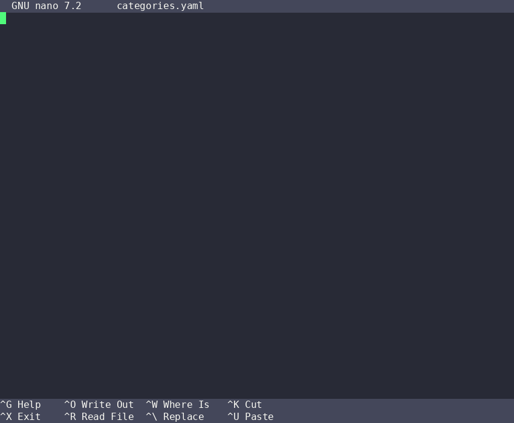
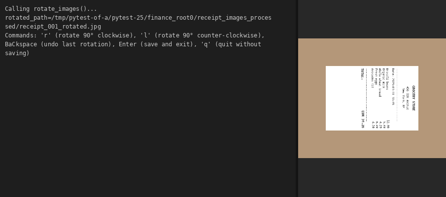
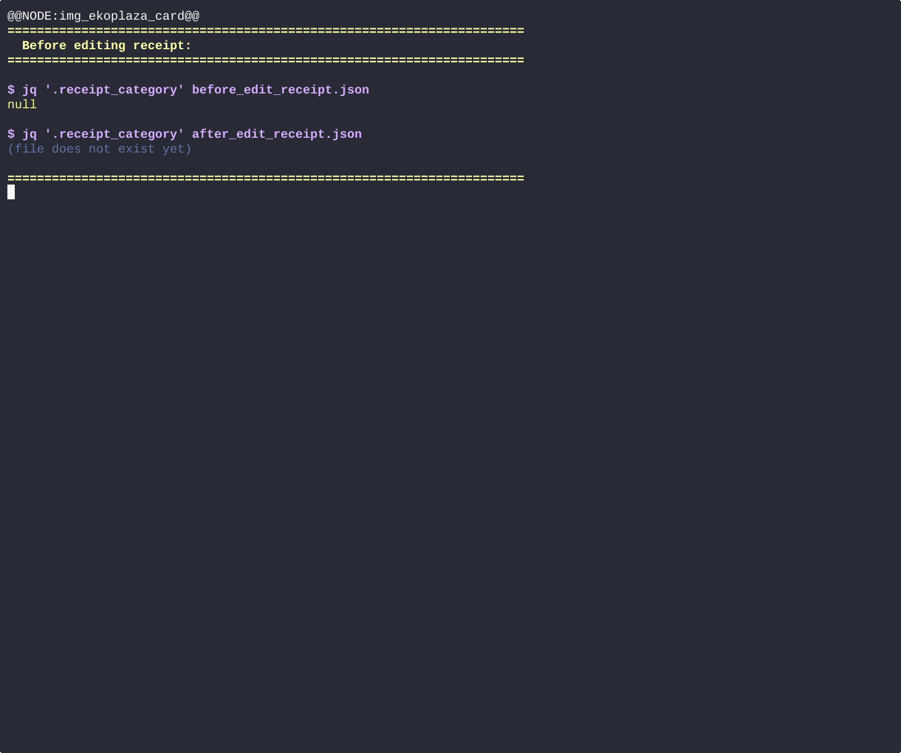
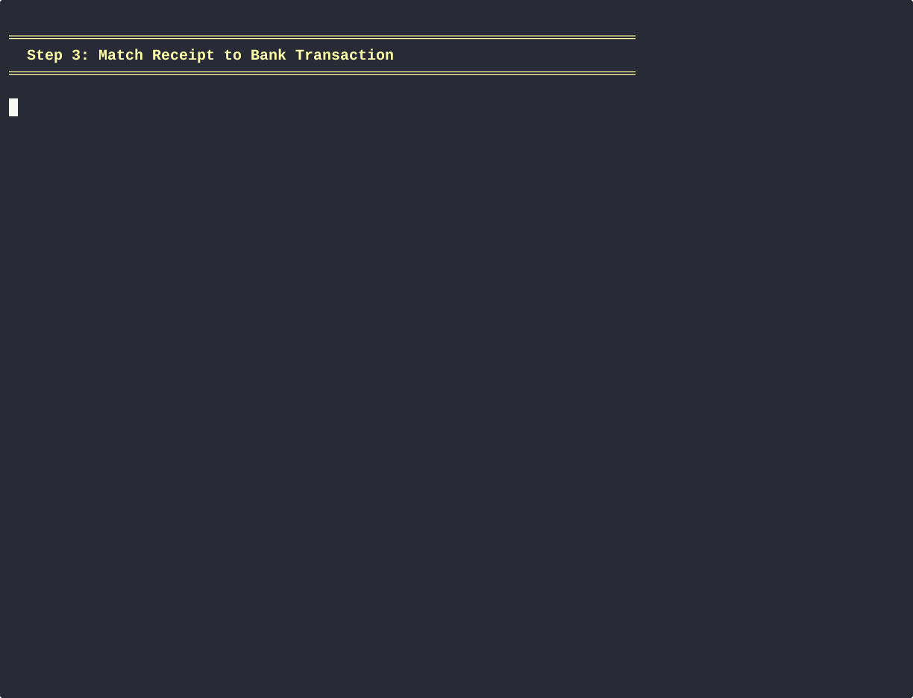
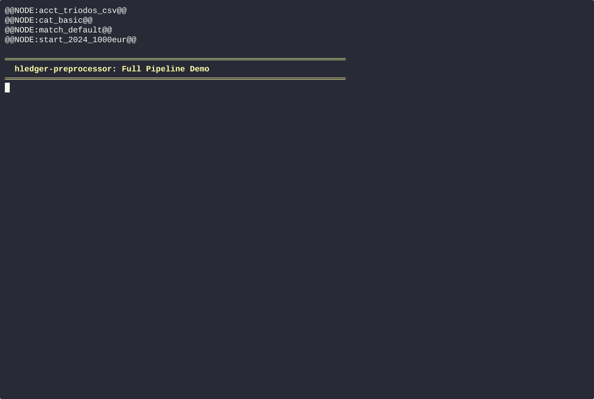
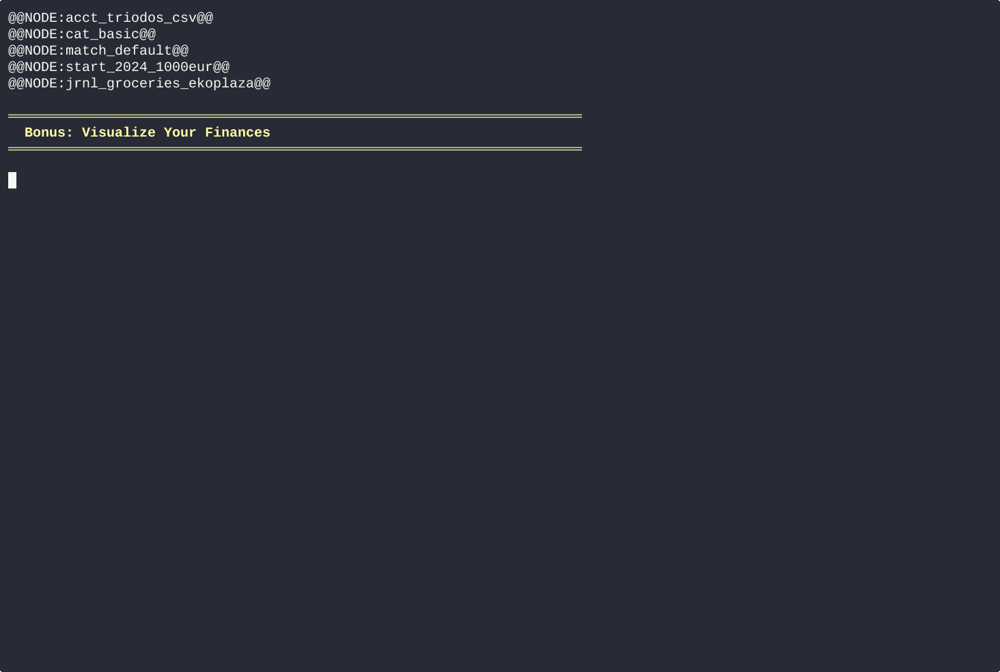
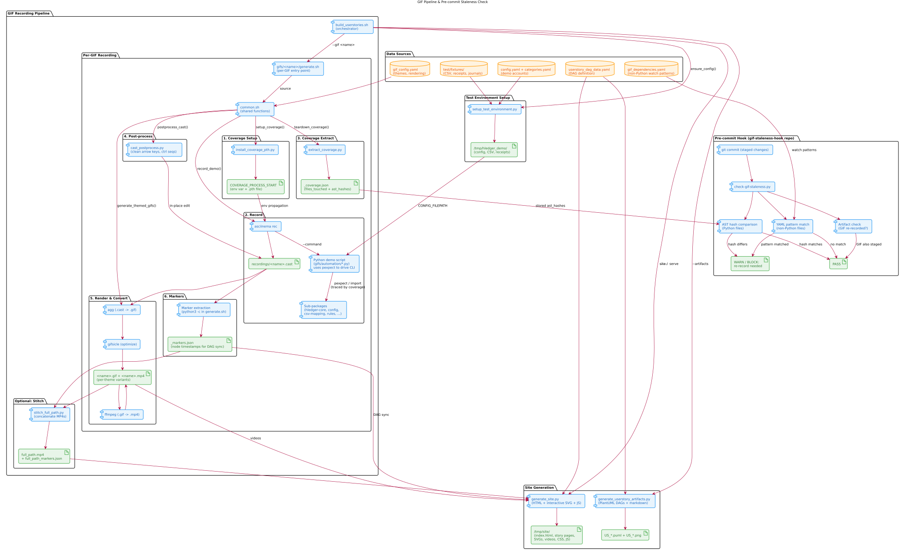

# Hledger .csv bank statement preprocessor for hledger-flow

[![Python 3.12][python_badge]](https://www.python.org/downloads/release/python-3120/)
[![License: AGPL v3][agpl3_badge]](https://www.gnu.org/licenses/agpl-3.0)
[![Code Style: Black][black_badge]](https://github.com/ambv/black)

This pip package is called by the
[modified hledger-flow repository](https://github.com/a-t-0/hledger-flow)
to pre-processes and categorise bank `.csv` files and receipts so that
`hledger-flow` can convert them into `hledger` journals.

\<TODO: insert randomized hledger plot with treemap>
\<TODO: insert randomized hledger plot with sankey>

## Demos (auto-generated from integration tests)

### Quick Start: 5-Step Workflow

**Step 1a: Configure your accounts**

Set up your bank accounts and wallets in `config.yaml`:


**Step 1b: Define your categories**

Add spending categories to `categories.yaml`:



**Step 2a: Rotate & Crop your receipts**

Use the CLI to rotate and crop your receipts (if necessary), to increase their zoomed readability and reduce noise.



**Step 2b: Label your receipts**

Use the TUI to label receipt images with date, shop, amount, and payment method:



**Step 3: Match receipts to bank transactions**

Algorithmically/semi-automated linking of receipts to your bank/exchange CSV transactions (prevents *duplicate double-entry bookkeeping postings*):



**Step 4: Run the pipeline**

Run the full pipeline (preprocess, import, balance report, plots) with a single command:

```bash
hledger_preprocessor --run-pipeline --config /path/to/your/config.yaml
```



______________________________________________________________________

### Step 5: Visualize Your Finances

Use `hledger_plot` to create interactive Sankey diagrams and Treemap plots:



______________________________________________________________________

### Additional Features

- Include performance metrics of various self-hosted AIs:

\<TODO: add performance metrics various ai modules>

- AI for: bank `.csv` transaction-> categorisation (e.g. groceries:wholefoods, repairs:bike etc.)

\<TODO: add gif>

- AI for: receipt image -> structured text (e.g. a json/dictionary with the time, shop, bought items, total, taxes etc.)

\<TODO: add gif>

- AI for: receipt image -> categorisation (e.g. groceries, repairs etc.)

\<TODO: add gif>

## User Story DAG Explorer

Browse user stories with synchronized video + interactive DAG diagrams.
Use **Up/Down** arrows (or **j/k**) to jump between DAG nodes in the video. Click a node to seek.

### Pipeline overview

The diagram below shows how user stories flow from YAML definitions through
test data, Python demo scripts, shell scripts, and recording tools to produce
GIF/MP4 files and the interactive website. It also shows how the pre-commit
staleness hook uses AST hashes and YAML patterns to detect when GIFs need
re-recording.



<details>
<summary>PlantUML source</summary>

See [docs/gif_pipeline_overview.puml](docs/gif_pipeline_overview.puml).
To regenerate: `plantuml -tsvg docs/gif_pipeline_overview.puml`
</details>

### Quick build & serve

```bash
# Re-record a GIF, rebuild site, and serve:
./build_userstories.sh --gif 2b_label_receipt --serve

# Full rebuild (artifacts + site) and serve locally:
./build_userstories.sh --serve

# Just serve (no rebuild — instant start):
./build_userstories.sh --serve-only

# Then open http://localhost:8059
```

Config-dependent GIFs (e.g. `2b_label_receipt`) auto-generate their demo
environment via `setup_test_environment.py` when no `--config` is given.

### Build script usage

`build_userstories.sh` orchestrates the full pipeline: artifacts → GIFs → site.

```bash
./build_userstories.sh                     # Full rebuild (artifacts + site)
./build_userstories.sh --site              # Site generation only (needs artifacts)
./build_userstories.sh --serve [port]      # Build + serve (default port: 8059)
./build_userstories.sh --serve-only [port] # Just serve (no rebuild, default port: 8059)
./build_userstories.sh --artifacts         # DAG diagrams + markdown only
./build_userstories.sh --gifs              # Re-record all GIFs
./build_userstories.sh --gifs-standalone   # Re-record self-contained GIFs only
./build_userstories.sh --gifs-config       # Re-record config-dependent GIFs
./build_userstories.sh --gif <dir_name>    # Re-record a single GIF (e.g. 2b_label_receipt)
./build_userstories.sh --dry-run           # Show what would run without executing
```

Options: `--output <dir>`, `--config <path>`, `--no-svg`, `--no-render`.

### Manual steps (alternative)

```bash
# 1. Generate artifacts (DAG diagrams + markdown)
python user_stories/dag/generate_userstory_artifacts.py -a --render

# 2. Generate site
python user_stories/dag/generate_site.py --output /tmp/site/

# 3. Serve
python -m http.server 8059 --directory /tmp/site/
```

## Tests

```bash
# Run all tests
python -m pytest

# Run a specific test
python -m pytest test/e2e/test_gif_1a_setup_config.py -v

# Run only unit/integration tests (skip slow e2e GIF generation)
python -m pytest test/unit/ test/integration/

# Run only e2e tests (these also regenerate GIFs as a side effect)
python -m pytest test/e2e/
```

The e2e tests (`test/e2e/test_gif_*.py`) call the same `generate.sh` scripts
used by `build_userstories.sh`, so running `python -m pytest test/e2e/` will
regenerate GIFs and validate their output (GIF/MP4 existence, marker JSON
structure, timestamp ordering).

## GIF Staleness Pre-commit Hook

A pre-commit hook detects when code changes may invalidate GIF recordings.
It uses two data sources:

1. **Coverage traces** (primary) — when a GIF is recorded, `coverage.py`
   traces every Python file executed. The trace is saved as
   `gifs/<name>/output/<name>_coverage.json`. On commit, the hook checks
   whether any staged file appears in a GIF's trace.
2. **`gif_dependencies.yaml`** (secondary) — manually maintained patterns
   for non-Python files (shell scripts, YAML fixtures, receipt images).

### Installation

Add to your `.pre-commit-config.yaml`:

```yaml
- repo: https://github.com/hledger-flow-receipt-parsing-AI/gif-staleness-hook
  rev: v0.1.0
  hooks:
    - id: check-gif-staleness
      args: [--bootstrap]  # remove once all GIFs have _coverage.json
```

Then run `pre-commit install`.

### Usage

The hook runs automatically on `git commit`. Flags:

| Flag | Effect |
|------|--------|
| `--bootstrap` | Treat missing `_coverage.json` as warnings (use during transition) |
| `--block` | Exit 1 on stale GIFs (default: warn only) |
| `--ci` | Compare `HEAD~1..HEAD` instead of staged files |

### Recording GIFs with coverage

Coverage tracing is built into `common.sh`. When you record a GIF via
`build_userstories.sh --gif <name>`, coverage is automatically collected
and written to `gifs/<name>/output/<name>_coverage.json`.

## Getting Started

This is a HELPER-MODULE for `hledger-flow`.

To get started with this repo, see [TL;DR.md](TL;DR.md)

For troubleshooting or more understanding per module/component of your bookkeeping setup, see:

- [manuals/A_dev_instructions.md](manuals/A_dev_instructions.md).
- [manuals/B_using_hledger.md](manuals/B_using_hledger.md).
- [manuals/C_installing_hledger-flow.md](manuals/C_installing_hledger-flow.md).
- [manuals/D_using_hledger-flow.md](manuals/D_using_hledger-flow.md).
- [manuals/D_hledger_preprocessor.md](manuals/C_using_hledger.md).
- [manuals/J_TLDR.md](manuals/J_TLDR.md).

## Terminology

- A **journal** is a list of transactions, e.g: the icecream you bought on your way
  up to Mount Everest, and the salt you bought whilst swimming in the ocean etc.
- A **posting** is a single transaction in a journal.
- **Credit** is for currency going out of an account.
- **Debit** is for currency going into an account.
- **tendered_amount_out** if you pay 50,- (cash) and get 13.24 change back,
  `tendered_amount_out=50,-` going out of the account, with a
  `net_amount_out=tendered_amount_out-change_returned=50-13.24=46.76`.

## Introduction

I used to think that book keeping was an automated process. I did not think
about why people did bookkeeping, I thought it was just good habits/required.
However, (double-entry) bookkeeping is (currently) manual labour, as it
requires:

- A. Making a financial planning, of what you want to earn, spend and save.
- B. Tracking where your money went.
- C Checking how your actual income, expenses and savings compare to financial
  planning.
- D. Updating your habits and choices based on the/any difference, and re-starting
  the cycle.

For many people step A and B are already challenging do do consistently. I
expect steps C. and D. to be even harder.

## Context

In double-entry bookkeeping, transactions need to be classified into
categories, e.g. groceries, rent, income etc.

## Functionality

This preprocessing repo aims to support automatically parsing bank statements
and receipt images into information that hledger-flow can convert into
journals/postings.

### AI models

I prefer deterministic logic over AI models. Users can choose to use 3
different `SELF-HOSTED` AI models in this module:

- AI for: bank `.csv` transaction-> categorisation (e.g. groceries:wholefoods, repairs:bike etc.)
- AI for: receipt image -> structured text (e.g. a dictionary with the time, shop, bought items, total, taxes etc.)
- AI for: receipt image -> categorisation (e.g. groceries, repairs etc.)
  Users should always be able to choose to manually use their own logic instead
  of an AI.

### Bank statements

Bank statements like `.csv` files can relatively easily be categorised using
logic. For example, if the transaction is done at a groceries shop, you can
easily categorise the whole transaction as "groceries". However, that still
requires manual labour, so the user can also choose to use AI based transaction
classifications.

- Pure logic based transaction classification (preferred).
- AI-based auto-transaction classification.

Currently the bank `.csv` statement transaction AI classifiers are not that
good, I hope to build an open source dataset using the categorisation logic and
transactions to train/finetune categorisation models. I do not yet have a
pipeline to build that dataset.

### (Automated) Receipt Labelling

Receipts require more labour as they are to be read and converted into
digital format to parse them and convert them into `hledger` journals/postings.
So different AI models are used to automatically convert receipt images into
JSON `Receipt` objects. Then these `Receipt` objects are converted into
`Transaction` objects that can be converted into hledger journals/postings.

The receipts are first converted into receipt objects to store the receipt data
as completely as possible, such that the receipt object database can be used to
finetune/train the receipt-image->structured text AI models. However `hledger`
only needs specific data for its transactions, hence the `Receipt` object is
then converted into a `Transaction` object.

The receipt objects are not yet categorised automatically using the above AI.
\<TODO: insert example receipt image>
\<TODO: insert receipt CLI demo>

### Receipt transaction matching

Some receipts, e.g. those paid by bank card, will match the transactions in a
bank `.csv` statement. Some matching algorithm is proposed to auto-generate the
labels for the `receipt image -> structured text` database. For example:
if the receipt has a timestamp of 2025-01-29T21:55:95 and a bank account that
ends in `XXYY1342`, one can match it to the transaction of that time. A
matching algorithm has been implemented to automate the receipt matching to
`.csv` transactions and a CLI is built to resolve mismatches, e.g. in foreign
currency exchanges with withdrawl fees, as quick as possible. The match/link
is stored in both the transaction and the receipt.

\<TODO: insert matching algorithm CLI demo>

<!-- Un-wrapped URL's below (Mostly for Badges) -->

[agpl3_badge]: https://img.shields.io/badge/License-AGPL_v3-blue.svg
[black_badge]: https://img.shields.io/badge/code%20style-black-000000.svg
[python_badge]: https://img.shields.io/badge/python-3.6-blue.svg
