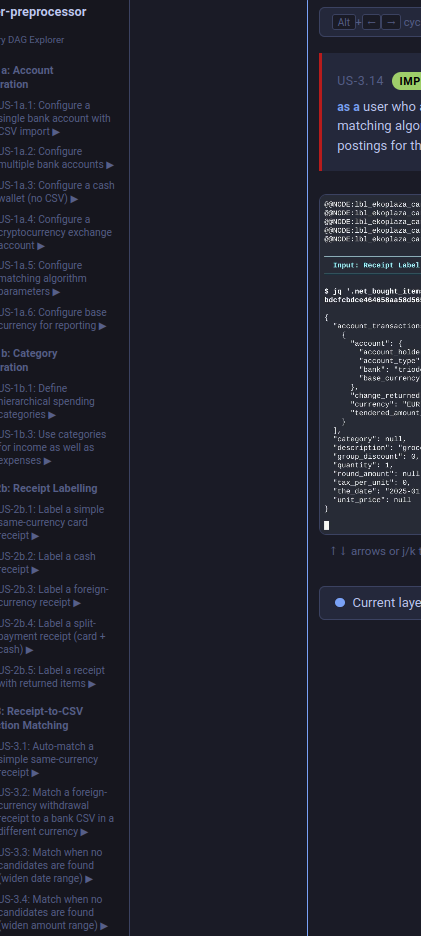

# UI Issues v7 — Corrected DAG Sequences per User Story

A. If I select the DAG diagram in a userstory and do ctrl+ or -, the text DAG Diagram and toggle Segment/FullPatth get smaller or larger, but the box itself (and the graph) stay the same size. I want that box to become smaller or larger, and the graph to grow with it (and always fit exactly/tight in that box.)

B. If I press right on the main page it goes to the next userstory, but if it goes to the last one on screen the screen scrolls down to keep the selected userstory in place. Change that left pane into a rolling bar that follows:
You can select the top userstory at the top of the screen, you can scroll down, if the selector goes out of screen the left pane with userstories just scrolls/rolls up untill the last one is in view, then you can't go down anymore only up. (Similarly if you're at the top, you can only go down.).

C. The pane/vertical bar between the userstories on the userstories, and the actual box with the gif, the diagram and the navigation bar and userstory still exists. That last big box should be directly touching the userstory pane (moved left). Don't know if you can see this, but this is a screenshot containing that unneeded pane in the middel of the picture:.

D. If I press Ctrl+L it does not go into the address bar anymore.
